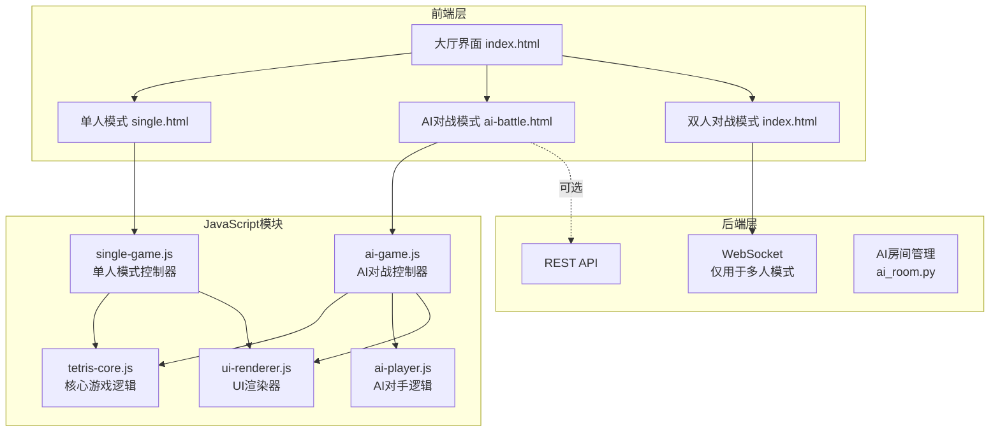

# 俄罗斯方块单人模式实现方案

## 1. 架构概览

### 1.1 整体架构图



### 1.2 单人模式与多人模式对比

| 特性 | 简单单人模式 | AI对战模式 | 多人对战模式 |
|------|-------------|-----------|-------------|
| 网络需求 | ❌ 不需要 | ⚠️ 可选/本地 | ✅ 必需 |
| 游戏区域 | 1个 | 2个（玩家+AI） | 2个（玩家1+玩家2） |
| 对手类型 | 无 | AI | 真人 |
| 服务器依赖 | 无 | 可选记录分数 | WebSocket房间 |
| 道具系统 | 简化/无 | 完整 | 完整 |

---

## 2. 详细设计方案

### 2.1 前端模块设计

#### 2.1.1 核心游戏逻辑模块 (tetris-core.js)

复用后端 [`TetrisGame`](backend/models/game.py:17) 类的前端实现：

```javascript
class TetrisCore {
    // 游戏状态
    board: number[][]          // 游戏板
    currentPiece: Tetromino    // 当前方块
    nextPiece: Tetromino       // 下一个方块
    score: number
    lines: number
    level: number
    gameOver: boolean
    paused: boolean
    
    // 核心方法
    moveLeft(): boolean
    moveRight(): boolean
    moveDown(): boolean
    rotate(): boolean
    hardDrop(): void
    update(): void             // 自动下落
    getGhostPiece(): Tetromino // 幽灵方块
}
```

#### 2.1.2 单人模式控制器 (single-game.js)

```javascript
class SingleGameController {
    constructor() {
        this.game = new TetrisCore();
        this.renderer = new UIRenderer('game-canvas');
        this.isRunning = false;
        this.lastTick = 0;
        this.tickInterval = 1000; // 初始下落间隔
    }
    
    start() { /* 开始游戏循环 */ }
    pause() { /* 暂停游戏 */ }
    gameLoop(timestamp) { /* 主循环 */ }
    handleInput(key) { /* 按键处理 */ }
    gameOver() { /* 游戏结束处理 */ }
}
```

#### 2.1.3 AI对手模块 (ai-player.js)

```javascript
class AIPlayer {
    constructor(difficulty = 'normal') {
        this.difficulty = difficulty; // easy/normal/hard
        this.game = new TetrisCore();
        this.thinkTimer = null;
    }
    
    // AI决策方法
    think(): Action {
        // 评估最佳移动
        const bestMove = this.findBestMove();
        return this.convertToActions(bestMove);
    }
    
    // 评估函数 - 基于 Pierre Dellacherie 算法
    evaluatePosition(board, piece): number {
        // 评估因素：
        // 1. 着陆高度 (Landing Height)
        // 2. 消行数 (Rows Cleared)
        // 3. 行变换 (Row Transitions)
        // 4. 列变换 (Column Transitions)
        // 5. 空洞数 (Holes)
        // 6. 井深 (Well Sums)
    }
    
    // 难度控制
    getThinkDelay(): number {
        switch(this.difficulty) {
            case 'easy': return 500 + Math.random() * 500;
            case 'normal': return 200 + Math.random() * 300;
            case 'hard': return 50 + Math.random() * 100;
        }
    }
}
```

### 2.2 页面结构设计

#### 2.2.1 大厅界面修改 ([`index.html`](frontend/index.html:11))

在大厅添加模式选择：

```html
<div class="game-mode-selection">
    <h2>选择游戏模式</h2>
    <div class="mode-buttons">
        <button id="btn-single-mode" class="btn btn-mode">
            <span class="icon">🎮</span>
            <span class="label">单人练习</span>
            <span class="desc">本地游戏，无需联网</span>
        </button>
        <button id="btn-ai-mode" class="btn btn-mode">
            <span class="icon">🤖</span>
            <span class="label">AI对战</span>
            <span class="desc">与电脑对战</span>
        </button>
        <button id="btn-multi-mode" class="btn btn-mode">
            <span class="icon">👥</span>
            <span class="label">双人对战</span>
            <span class="desc">在线匹配玩家</span>
        </button>
    </div>
</div>
```

#### 2.2.2 单人游戏界面 ([`single.html`](frontend/index.html:39))

简化版游戏界面（只有1个游戏区域）：

```html
<div id="single-game-screen" class="screen">
    <div class="single-game-container">
        <!-- 头部信息 -->
        <div class="game-header">
            <h2>单人模式</h2>
            <button id="btn-back" class="btn btn-small">返回</button>
        </div>
        
        <!-- 游戏主体 -->
        <div class="single-game-layout">
            <!-- 左侧：游戏区域 -->
            <div class="main-board-area">
                <canvas id="game-board" width="300" height="600"></canvas>
                <div id="game-overlay" class="overlay">
                    <div class="overlay-content">
                        <h2>暂停</h2>
                        <button id="btn-resume">继续</button>
                        <button id="btn-restart">重新开始</button>
                    </div>
                </div>
            </div>
            
            <!-- 右侧：信息面板 -->
            <div class="side-panel">
                <!-- 下一个方块 -->
                <div class="preview-box">
                    <h4>下一个</h4>
                    <canvas id="next-piece" width="120" height="120"></canvas>
                </div>
                
                <!-- 游戏信息 -->
                <div class="game-stats">
                    <div class="stat-item">
                        <span class="label">分数</span>
                        <span id="score" class="value">0</span>
                    </div>
                    <div class="stat-item">
                        <span class="label">行数</span>
                        <span id="lines" class="value">0</span>
                    </div>
                    <div class="stat-item">
                        <span class="label">等级</span>
                        <span id="level" class="value">1</span>
                    </div>
                </div>
                
                <!-- 操作说明 -->
                <div class="controls-help">
                    <h4>操作</h4>
                    <ul>
                        <li>← → 左右移动</li>
                        <li>↑ 旋转</li>
                        <li>↓ 加速下落</li>
                        <li>空格 直接落下</li>
                        <li>P 暂停</li>
                    </ul>
                </div>
            </div>
        </div>
    </div>
</div>
```

### 2.3 后端设计

#### 2.3.1 AI房间管理 (可选)

```python
# backend/models/ai_room.py
class AIPlayer:
    """AI玩家实现"""
    def __init__(self, difficulty: str = "normal"):
        self.game = TetrisGame("ai_player")
        self.difficulty = difficulty
        self.action_queue = []
        
    async def think_and_act(self):
        """AI思考并执行动作"""
        # 模拟思考时间
        await asyncio.sleep(self.get_think_delay())
        
        # 计算最佳动作
        best_action = self.calculate_best_move()
        self.execute_action(best_action)

class AIRoom(BattleRoom):
    """AI对战房间"""
    def __init__(self, room_id: str, difficulty: str = "normal"):
        super().__init__(room_id)
        self.ai_player = AIPlayer(difficulty)
        self.ai_task = None
        
    async def start_game(self):
        """开始游戏，启动AI循环"""
        await super().start_game()
        self.ai_task = asyncio.create_task(self.ai_loop())
        
    async def ai_loop(self):
        """AI主循环"""
        while self.game_active and not self.ai_player.game.game_over:
            await self.ai_player.think_and_act()
            await self.broadcast_state()
```

---

## 3. 实现任务清单

### 3.1 前端实现任务

```markdown
- [ ] 创建 `frontend/js/tetris-core.js` - 核心游戏逻辑
  - [ ] 移植后端 TetrisGame 到前端
  - [ ] 实现方块移动、旋转、消除逻辑
  - [ ] 实现分数计算和等级提升
  - [ ] 实现幽灵方块显示

- [ ] 创建 `frontend/js/single-game.js` - 单人模式控制器
  - [ ] 实现游戏循环（requestAnimationFrame）
  - [ ] 实现键盘输入处理
  - [ ] 实现暂停/继续功能
  - [ ] 实现游戏结束和重新开始

- [ ] 创建 `frontend/js/ai-player.js` - AI对手逻辑
  - [ ] 实现棋盘评估函数
  - [ ] 实现最佳移动搜索算法
  - [ ] 实现难度等级控制（思考速度）
  - [ ] 实现AI动作队列

- [ ] 创建 `frontend/js/ai-game.js` - AI对战控制器
  - [ ] 管理玩家和AI两个游戏实例
  - [ ] 协调双方游戏节奏
  - [ ] 实现胜负判定

- [ ] 创建 `frontend/single.html` - 单人游戏页面
  - [ ] 设计简洁的单人游戏界面
  - [ ] 添加返回按钮
  - [ ] 添加游戏信息显示

- [ ] 修改 `frontend/index.html` - 大厅界面
  - [ ] 添加模式选择按钮（单人/AI/双人）
  - [ ] 美化模式选择UI

- [ ] 修改 `frontend/css/style.css`
  - [ ] 添加单人模式样式
  - [ ] 添加AI对战模式样式
  - [ ] 添加模式选择按钮样式
```

### 3.2 后端实现任务

```markdown
- [ ] 创建 `backend/models/ai_player.py`
  - [ ] 实现 AIPlayer 类
  - [ ] 实现评估算法
  - [ ] 实现难度控制

- [ ] 创建 `backend/models/ai_room.py`（可选）
  - [ ] 实现 AIRoom 类
  - [ ] 实现 AI 游戏循环
  - [ ] 集成到房间管理器

- [ ] 修改 `backend/main.py`
  - [ ] 添加单人模式统计API（可选）
  - [ ] 添加AI房间创建API
```

### 3.3 集成测试任务

```markdown
- [ ] 测试单人模式基本功能
  - [ ] 方块移动和旋转
  - [ ] 行消除
  - [ ] 分数计算
  - [ ] 等级提升
  - [ ] 暂停/继续
  - [ ] 游戏结束

- [ ] 测试AI对战模式
  - [ ] AI能正常下落方块
  - [ ] AI能合理放置方块
  - [ ] 难度等级有效
  - [ ] 胜负判定正确
```

---

## 4. 关键技术决策

### 4.1 前端游戏循环设计

```javascript
// 使用 requestAnimationFrame 实现平滑动画
class GameLoop {
    constructor(updateCallback, renderCallback) {
        this.updateCallback = updateCallback;
        this.renderCallback = renderCallback;
        this.lastTime = 0;
        this.accumulator = 0;
        this.tickRate = 1000; // 1秒下落一次（根据等级调整）
    }
    
    loop(currentTime) {
        const deltaTime = currentTime - this.lastTime;
        this.lastTime = currentTime;
        
        this.accumulator += deltaTime;
        
        // 固定时间步长更新
        while (this.accumulator >= this.tickRate) {
            this.updateCallback();
            this.accumulator -= this.tickRate;
        }
        
        // 每帧渲染
        this.renderCallback();
        
        requestAnimationFrame((t) => this.loop(t));
    }
}
```

### 4.2 AI评估算法（Pierre Dellacherie）

```javascript
class AIEvaluator {
    // 权重配置（经过大量测试优化）
    static WEIGHTS = {
        landingHeight: -4.500158825082766,
        rowsCleared: 3.4181268101392694,
        rowTransitions: -3.2178882868487753,
        columnTransitions: -9.348695305445199,
        holes: -7.899265427351652,
        wellSums: -3.3855972247263626
    };
    
    evaluate(board, piece) {
        let score = 0;
        score += this.landingHeight(piece) * WEIGHTS.landingHeight;
        score += this.rowsCleared(board) * WEIGHTS.rowsCleared;
        score += this.rowTransitions(board) * WEIGHTS.rowTransitions;
        score += this.columnTransitions(board) * WEIGHTS.columnTransitions;
        score += this.holes(board) * WEIGHTS.holes;
        score += this.wellSums(board) * WEIGHTS.wellSums;
        return score;
    }
}
```

### 4.3 代码复用策略

| 组件 | 复用方式 | 说明 |
|------|---------|------|
| 游戏逻辑 | 前端移植 | 将后端 [`TetrisGame`](backend/models/game.py:17) 改写为前端 JavaScript |
| 方块定义 | 共享常量 | 前后端共用 [`SHAPES`](backend/config.py:54) 和 [`SHAPE_COLORS`](backend/config.py:65) |
| UI渲染 | 新建 | 单人模式UI简化，需要新的渲染器 |
| 道具系统 | 可选/简化 | 单人模式可禁用或简化道具 |

---

## 5. 项目文件结构

```
frontend/
├── index.html              # 大厅界面（添加模式选择）
├── single.html             # 单人模式页面
├── ai-battle.html          # AI对战页面（可选，也可复用index.html）
├── css/
│   └── style.css           # 添加单人模式样式
└── js/
    ├── tetris.js           # 现有多人模式逻辑
    ├── tetris-core.js      # [新建] 核心游戏逻辑
    ├── single-game.js      # [新建] 单人模式控制器
    ├── ai-player.js        # [新建] AI对手逻辑
    ├── ai-game.js          # [新建] AI对战控制器
    └── ui-renderer.js      # [新建] UI渲染器

backend/
├── main.py
├── models/
│   ├── __init__.py
│   ├── game.py
│   ├── tetromino.py
│   ├── items.py
│   ├── room.py
│   ├── ai_player.py        # [新建] AI玩家
│   └── ai_room.py          # [新建] AI房间（可选）
└── handlers/
    ├── __init__.py
    └── websocket.py
```

---

## 6. 实施建议

### 6.1 开发顺序

1. **Phase 1**: 实现 `tetris-core.js` 核心游戏逻辑
2. **Phase 2**: 实现单人模式页面和控制器
3. **Phase 3**: 实现AI评估算法
4. **Phase 4**: 实现AI对战模式
5. **Phase 5**: 集成测试和优化

### 6.2 注意事项

1. **性能优化**：AI搜索可能耗时，使用 Web Worker 避免阻塞主线程
2. **难度平衡**：AI难度应可调节，避免太简单或太困难
3. **代码复用**：尽量复用现有样式和常量定义
4. **向后兼容**：确保多人模式功能不受影响

---

## 7. 验收标准

- [ ] 单人模式可以正常运行，无需网络连接
- [ ] 方块移动、旋转、消除逻辑正确
- [ ] 分数和等级计算正确
- [ ] AI对手能合理放置方块，难度可调
- [ ] 界面美观，操作流畅
- [ ] 多人模式功能不受影响
